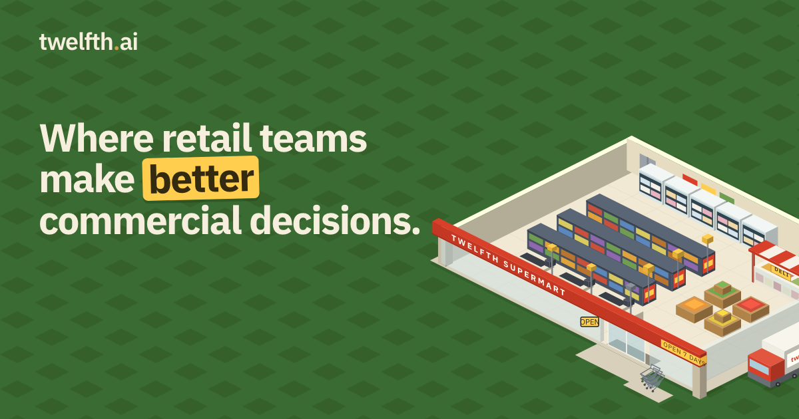
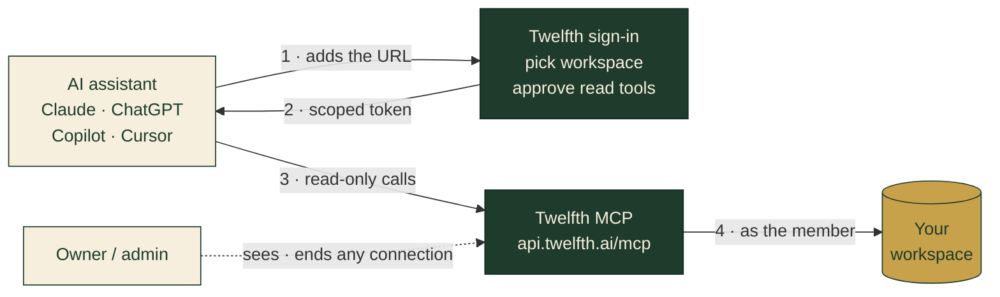

<p align="center">
  <a href="https://twelfth.ai/ai">
    
  </a>
</p>

<p align="center">
  <a href="https://registry.modelcontextprotocol.io/v0.1/servers?search=ai.twelfth/workspace&version=latest"></a>
  
  
  
  <a href="LICENSE"></a>
  <a href="https://smithery.ai/servers/twelfth/twelfth"></a>
</p>

<p align="center">
  <b>Connect the AI assistants your team already uses to its Twelfth workspace.</b><br>
  Claude · ChatGPT · GitHub Copilot · Gemini · Cursor · Claude Code · any MCP client
</p>

---

[Twelfth](https://twelfth.ai) is a commercial workspace for retail and category
teams. Its hosted MCP server lets an assistant read the products, suppliers,
sales, inventory, pricing, projects and open actions that the signed-in person
can already see, so questions are answered from your Twelfth workspace rather
than from a pasted spreadsheet.

| | |
| --- | --- |
| **Endpoint** | `https://api.twelfth.ai/mcp` (Streamable HTTP) |
| **Sign-in** | OAuth 2.1 with your Twelfth account. Choose the workspace and approve the read tools; no key to copy |
| **Access** | Read-only. Assistants cannot create, change or commit anything |
| **Scope** | One workspace, as the person who connected: their role, remits and categories. Owners and admins see and can end every connection |
| **Registry** | [`ai.twelfth/workspace`](https://registry.modelcontextprotocol.io/v0.1/servers?search=ai.twelfth/workspace&version=latest), published from the twelfth.ai domain |
| **Docs** | [twelfth.ai/ai](https://twelfth.ai/ai) · [MCP guide](https://twelfth.ai/developers/mcp) |

You need a Twelfth workspace to connect. [Book a demo](https://twelfth.ai/book-a-demo)
if your team doesn't have one yet.

## How it connects



## Install

### Cursor

Add Twelfth to `.cursor/mcp.json`. Cursor sends you to Twelfth to sign in on first use:

```json
{
  "mcpServers": {
    "twelfth": { "url": "https://api.twelfth.ai/mcp" }
  }
}
```

### Claude Code

```sh
/plugin marketplace add twelfth-ai/twelfth-mcp
/plugin install twelfth@twelfth
```

Or just the server: `claude mcp add --transport http twelfth https://api.twelfth.ai/mcp`

### Claude, ChatGPT, Gemini and other clients

Add a custom connector with the URL `https://api.twelfth.ai/mcp` and complete
the Twelfth sign-in. Per-assistant guides: [twelfth.ai/ai](https://twelfth.ai/ai).

### Servers and scripts

A workspace owner or admin can create a labelled, tool-limited key under
**Settings → AI & agents → Create an API key** and send it as
`Authorization: Bearer <key>`.

## Security and governance

| Control | How it works |
| --- | --- |
| **Read-only by design** | Every tool reads. Decisions are reviewed and committed by people inside Twelfth |
| **Least privilege** | An OAuth connection inherits the member's role and remits and stops working when they leave the workspace. Tools are chosen at consent |
| **Admin visibility** | Owners and admins see every connection, the client and version that connected, and can end any of them. An ended connection is refused on its next request |
| **Keys** | Created only by owners and admins, labelled by environment, limited to selected tools, stored hashed and shown once |
| **Audit** | Each call is logged with tool, outcome, time and duration. Tool results are never stored or sent to analytics; only their size is recorded |
| **Compliance** | Controls, sub-processors and our SOC 2 / ISO 27001 programme: [trust.twelfth.ai](https://trust.twelfth.ai) |

## What's in this repo

This repository holds client configuration only; the server is hosted and
operated by Twelfth AI Pty Ltd.

| Path | What |
| --- | --- |
| `plugins/twelfth/` | The plugin: MCP config for Cursor (`mcp.json`) and Claude Code (`.mcp.json`), and a `twelfth-workspace` skill that helps the assistant use the tools well |
| `.cursor-plugin/`, `.claude-plugin/` | Marketplace manifests for Cursor and Claude Code |

## Support

- Questions and enterprise enquiries: [hello@twelfth.ai](mailto:hello@twelfth.ai)
- Security reports: [security.txt](https://twelfth.ai/.well-known/security.txt)
- Privacy: [twelfth.ai/legals/privacy](https://twelfth.ai/legals/privacy)

<p align="center">
  <a href="https://twelfth.ai">
    <picture>
      <source media="(prefers-color-scheme: dark)" srcset="assets/wordmark-light.svg">
      
    </picture>
  </a>
  <br><sub>Twelfth AI Pty Ltd · ACN 695 769 138 · Australia</sub>
</p>

The contents of this repository are MIT licensed. The Twelfth service is
governed by its [terms](https://twelfth.ai/legals/terms).

smithery-verification=0c586824f907c08ca5140641c9ddc0c07e5e1574fd305497c14360c7f4ded531
